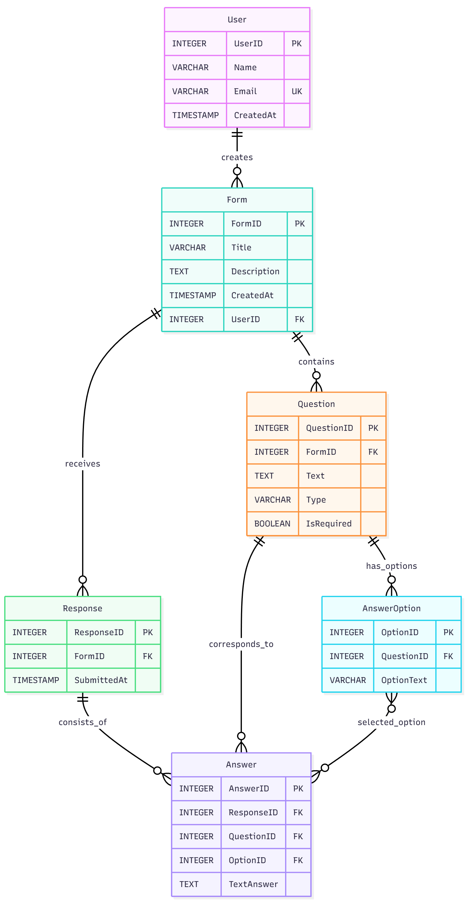

# Реляційна схема бази даних «KPI Forms» 💾

Цей документ містить логічну реляційну схему та DDL-скрипти (SQL-таблиці) для створення бази даних Системи «KPI Forms», оновлені відповідно до деталізованої бізнес-моделі.

## 1. Концептуальна реляційна схема

Схема розроблена для підтримки ключових функціональних вимог, включаючи створення форм, керування питаннями різних типів та забезпечення анонімного збору відповідей.

### Таблиця 1: User (Користувачі)

Зберігає інформацію про всіх користувачів системи (адміністраторів, студентів).

| Поле | Тип даних | Ключ | Обмеження / Примітки | 
| :--- | :--- | :--- | :--- | 
| **UserID** | INT | PRIMARY KEY | Обов'язкове, автогенерація. | 
| Name | VARCHAR(100) |  | Обов’язкове. | 
| Email | VARCHAR(255) | UNIQUE | Унікальне, обов’язкове. | 
| CreatedAt | DATETIME |  | Обов'язкове. | 

### Таблиця 2: Form (Форми/Опитування)

Зберігає інформацію про кожне створене опитування.

| Поле | Тип даних | Ключ | Обмеження / Примітки | 
| :--- | :--- | :--- | :--- | 
| **FormID** | INT | PRIMARY KEY | Обов'язкове, автогенерація. | 
| Title | VARCHAR(255) | NOT NULL | Обов’язкове. | 
| Description | TEXT |  | Необов’язкове. | 
| CreatedAt | DATETIME | NOT NULL | Обов’язкове. | 
| **UserID** | INT | FOREIGN KEY | Посилання на автора форми (User), обов'язкове. | 

### Таблиця 3: Question (Питання)

Зберігає деталі кожного питання в межах форми.

| Поле | Тип даних | Ключ | Обмеження / Примітки | 
| :--- | :--- | :--- | :--- | 
| **QuestionID** | INT | PRIMARY KEY | Обов'язкове, автогенерація. | 
| **FormID** | INT | FOREIGN KEY | Посилання на форму (Form), обов'язкове. | 
| Text | TEXT | NOT NULL | Текст питання, обов'язкове. | 
| Type | ENUM | NOT NULL | Тип питання (text, multiple\_choice, checkbox). | 
| IsRequired | BOOLEAN | DEFAULT FALSE | Чи є питання обов'язковим для відповіді. | 

### Таблиця 4: AnswerOption (Варіанти відповіді)

Зберігає варіанти відповіді для питань типу "multiple\_choice" або "checkbox".

| Поле | Тип даних | Ключ | Обмеження / Примітки | 
| :--- | :--- | :--- | :--- | 
| **OptionID** | INT | PRIMARY KEY | Обов'язкове. | 
| **QuestionID** | INT | FOREIGN KEY | Посилання на питання (Question), обов'язкове. | 
| OptionText | VARCHAR(255) | NOT NULL | Текст варіанта відповіді, обов'язкове. | 

### Таблиця 5: Response (Відповіді респондентів)

Запис про факт подачі однієї відповіді на форму.

| Поле | Тип даних | Ключ | Обмеження / Примітки | 
| :--- | :--- | :--- | :--- | 
| **ResponseID** | INT | PRIMARY KEY | Обов'язкове, автогенерація. | 
| **FormID** | INT | FOREIGN KEY | Посилання на форму (Form), обов'язкове. | 
| SubmittedAt | DATETIME | NOT NULL | Час подачі відповіді, обов'язкове. | 

### Таблиця 6: Answer (Відповіді на питання)

Зберігає фактичний зміст відповіді на конкретне питання.

| Поле | Тип даних | Ключ | Обмеження / Примітки | 
| :--- | :--- | :--- | :--- | 
| **AnswerID** | INT | PRIMARY KEY | Обов'язкове, автогенерація. | 
| **ResponseID** | INT | FOREIGN KEY | Посилання на загальну відповідь (Response), обов'язкове. | 
| **QuestionID** | INT | FOREIGN KEY | Посилання на питання (Question), обов'язкове. | 
| OptionID | INT | FOREIGN KEY | NULL, якщо відповідь текстова (Question Type = 'text'). | 
| TextAnswer | TEXT |  | NULL, якщо відповідь вибрано з варіантів (OptionID заповнено). | 

## 2. SQL-таблиці (DDL - Data Definition Language)

Нижче наведено SQL-скрипти для створення таблиць, які відповідають концептуальній моделі. Зверніть увагу, що тип `ENUM` та `SERIAL` можуть вимагати адаптації залежно від конкретної СУБД (наприклад, PostgreSQL, MySQL).

```sql
-- Таблиця 1: User (Користувачі)
CREATE TABLE User (
  UserID SERIAL PRIMARY KEY,
  Name VARCHAR(100) NOT NULL,
  Email VARCHAR(255) UNIQUE NOT NULL,
  CreatedAt TIMESTAMP DEFAULT CURRENT_TIMESTAMP NOT NULL
);

-- Таблиця 2: Form (Форми/Опитування)
CREATE TABLE Form (
  FormID SERIAL PRIMARY KEY,
  Title VARCHAR(255) NOT NULL,
  Description TEXT,
  CreatedAt TIMESTAMP DEFAULT CURRENT_TIMESTAMP NOT NULL,
  UserID INTEGER NOT NULL,
  FOREIGN KEY (UserID) REFERENCES User(UserID)
);

-- Таблиця 3: Question (Питання)
-- Примітка: Використання TEXT замість ENUM для Type, щоб забезпечити сумісність.
CREATE TABLE Question (
  QuestionID SERIAL PRIMARY KEY,
  FormID INTEGER NOT NULL,
  Text TEXT NOT NULL,
  Type VARCHAR(50) NOT NULL CHECK (Type IN ('text', 'multiple_choice', 'checkbox', 'scale')),
  IsRequired BOOLEAN DEFAULT FALSE,
  FOREIGN KEY (FormID) REFERENCES Form(FormID)
);

-- Таблиця 4: AnswerOption (Варіанти відповіді)
CREATE TABLE AnswerOption (
  OptionID SERIAL PRIMARY KEY,
  QuestionID INTEGER NOT NULL,
  OptionText VARCHAR(255) NOT NULL,
  FOREIGN KEY (QuestionID) REFERENCES Question(QuestionID)
);

-- Таблиця 5: Response (Відповіді респондентів)
-- Примітка: user_id не додано, оскільки в бізнес-моделі цього немає, і це відповідає вимозі анонімності.
CREATE TABLE Response (
  ResponseID SERIAL PRIMARY KEY,
  FormID INTEGER NOT NULL,
  SubmittedAt TIMESTAMP DEFAULT CURRENT_TIMESTAMP NOT NULL,
  FOREIGN KEY (FormID) REFERENCES Form(FormID)
);

-- Таблиця 6: Answer (Відповіді на питання)
-- Примітка: Відповідно до анонімної моделі, UserID з Response не посилається.
CREATE TABLE Answer (
  AnswerID SERIAL PRIMARY KEY,
  ResponseID INTEGER NOT NULL,
  QuestionID INTEGER NOT NULL,
  OptionID INTEGER, -- FK, NULLABLE для текстових відповідей
  TextAnswer TEXT,   -- NULLABLE для відповідей з варіантами
  FOREIGN KEY (ResponseID) REFERENCES Response(ResponseID),
  FOREIGN KEY (QuestionID) REFERENCES Question(QuestionID),
  FOREIGN KEY (OptionID) REFERENCES AnswerOption(OptionID)
);
```
## Візуальна ER-діаграма
