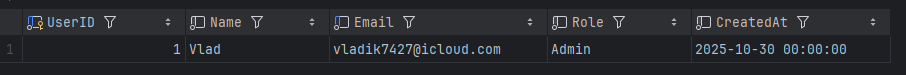
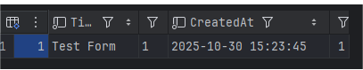

# Лабораторна робота №6
**Тема:** Реалізація об’єктно-реляційного відображення (KPIForm)

## Структура проєкту
```
src/
 └─ db_instances/
      ├─ Answer.java
      ├─ AnswerOption.java
      ├─ Form.java
      ├─ Question.java
      ├─ Response.java
      └─ User.java
 └─ dao/
      ├─ DAO.java
      ├─ AnswerDAO.java
      ├─ AnswerOptionDAO.java
      ├─ FormDAO.java
      ├─ QuestionDAO.java
      ├─ ResponseDAO.java
      └─ UserDAO.java
 └─ util/
      └─ DBConnection.java
 └─ MainTest.java
```

## SQL: Створення бази даних
```sql
-- Створення бази даних
CREATE DATABASE KPIForm
  CHARACTER SET utf8mb4
  COLLATE utf8mb4_unicode_ci;

-- Використати базу
USE KPIForm;

-- Таблиця 1: User (Користувачі)
CREATE TABLE `User` (
  UserID INT AUTO_INCREMENT PRIMARY KEY,
  Name VARCHAR(100) NOT NULL,
  Email VARCHAR(255) UNIQUE NOT NULL,
  Role VARCHAR(50) NOT NULL, -- Student, AdminU, SysAdmin
  CreatedAt TIMESTAMP DEFAULT CURRENT_TIMESTAMP NOT NULL
);

-- Таблиця 2: Form (Форми/Опитування)
CREATE TABLE Form (
  FormID INT AUTO_INCREMENT PRIMARY KEY,
  Title VARCHAR(255) NOT NULL,
  Description TEXT,
  CreatedAt TIMESTAMP DEFAULT CURRENT_TIMESTAMP NOT NULL,
  UserID INT NOT NULL,
  FOREIGN KEY (UserID) REFERENCES `User`(UserID)
    ON DELETE CASCADE
);

-- Таблиця 3: Question (Питання)
CREATE TABLE Question (
  QuestionID INT AUTO_INCREMENT PRIMARY KEY,
  FormID INT NOT NULL,
  Text TEXT NOT NULL,
  Type VARCHAR(50) NOT NULL CHECK (Type IN ('text', 'multiple_choice', 'checkbox', 'scale')),
  IsRequired BOOLEAN DEFAULT FALSE,
  FOREIGN KEY (FormID) REFERENCES Form(FormID)
    ON DELETE CASCADE
);

-- Таблиця 4: AnswerOption (Варіанти відповіді)
CREATE TABLE AnswerOption (
  OptionID INT AUTO_INCREMENT PRIMARY KEY,
  QuestionID INT NOT NULL,
  OptionText VARCHAR(255) NOT NULL,
  FOREIGN KEY (QuestionID) REFERENCES Question(QuestionID)
    ON DELETE CASCADE
);

-- Таблиця 5: Response (Відповіді респондентів)
CREATE TABLE Response (
  ResponseID INT AUTO_INCREMENT PRIMARY KEY,
  FormID INT NOT NULL,
  SubmittedAt TIMESTAMP DEFAULT CURRENT_TIMESTAMP NOT NULL,
  FOREIGN KEY (FormID) REFERENCES Form(FormID)
    ON DELETE CASCADE
);

-- Таблиця 6: Answer (Відповіді на питання)
CREATE TABLE Answer (
  AnswerID INT AUTO_INCREMENT PRIMARY KEY,
  ResponseID INT NOT NULL,
  QuestionID INT NOT NULL,
  OptionID INT NULL,
  TextAnswer TEXT,
  FOREIGN KEY (ResponseID) REFERENCES Response(ResponseID)
    ON DELETE CASCADE,
  FOREIGN KEY (QuestionID) REFERENCES Question(QuestionID)
    ON DELETE CASCADE,
  FOREIGN KEY (OptionID) REFERENCES AnswerOption(OptionID)
    ON DELETE SET NULL
);

```
## Bean-класи
[Source code](https://github.com/vvladik7426/obd-team-repo/tree/main/src/bean/KPI)

---
### Основні класи
**Form.java**
```java
package db_instances;

import java.sql.Timestamp;

public class Form {
    public int FormID;
    public String Title;
    public int Description;
    public Timestamp CreatedAt;
    public int UserID;
}
```
**User.java**
```java
package db_instances;

public class User {
    public int UserId;
    public String Name;
    public String Email;
    public String CreatedAt;
    public String role;
}
```
**DAO.java**

Інтерфейс, в який ми будемо обгортати FormDAO, UserDAO та інші, щоб підтримувати правильну структуру класів, що будуть взаємодіяти з базою даних.
```java
package dao;

import java.util.List;

public interface DAO<T> {
    void create(T obj) throws Exception;
    T findById(int id) throws Exception;
    List<T> findAll() throws Exception;
    void update(T obj) throws Exception;
    void delete(int id) throws Exception;
}
```
Приклад обгорнутого в DAO класу на основі класу User:
```java
package dao;

import db_instances.User;
import util.DBConnection;

import java.sql.*;
import java.util.ArrayList;
import java.util.List;

public class UserDAO implements DAO<User> {

    @Override
    public void create(User user) throws SQLException {
        String sql = "INSERT INTO User (Name, Email, CreatedAt, role) VALUES (?, ?, ?, ?)";
        try (Connection conn = DBConnection.getConnection();
             PreparedStatement ps = conn.prepareStatement(sql, Statement.RETURN_GENERATED_KEYS)) {
            ps.setString(1, user.Name);
            ps.setString(2, user.Email);
            ps.setString(3, user.CreatedAt);
            ps.setString(4, user.role);
            ps.executeUpdate();

            ResultSet rs = ps.getGeneratedKeys();
            if (rs.next()) user.UserId = rs.getInt(1);
        }
    }

    @Override
    public User findById(int id) throws SQLException {
        String sql = "SELECT * FROM User WHERE UserId = ?";
        try (Connection conn = DBConnection.getConnection();
             PreparedStatement ps = conn.prepareStatement(sql)) {
            ps.setInt(1, id);
            ResultSet rs = ps.executeQuery();
            if (rs.next()) {
                User u = new User();
                u.UserId = rs.getInt("UserId");
                u.Name = rs.getString("Name");
                u.Email = rs.getString("Email");
                u.CreatedAt = rs.getString("CreatedAt");
                u.role = rs.getString("role");
                return u;
            }
        }
        return null;
    }

    @Override
    public List<User> findAll() throws SQLException {
        String sql = "SELECT * FROM User";
        List<User> users = new ArrayList<>();
        try (Connection conn = DBConnection.getConnection();
             Statement st = conn.createStatement()) {
            ResultSet rs = st.executeQuery(sql);
            while (rs.next()) {
                User u = new User();
                u.UserId = rs.getInt("UserId");
                u.Name = rs.getString("Name");
                u.Email = rs.getString("Email");
                u.CreatedAt = rs.getString("CreatedAt");
                u.role = rs.getString("role");
                users.add(u);
            }
        }
        return users;
    }

    @Override
    public void update(User user) throws SQLException {
        String sql = "UPDATE User SET Name=?, Email=?, CreatedAt=?, role=? WHERE UserId=?";
        try (Connection conn = DBConnection.getConnection();
             PreparedStatement ps = conn.prepareStatement(sql)) {
            ps.setString(1, user.Name);
            ps.setString(2, user.Email);
            ps.setString(3, user.CreatedAt);
            ps.setString(4, user.role);
            ps.setInt(5, user.UserId);
            ps.executeUpdate();
        }
    }

    @Override
    public void delete(int id) throws SQLException {
        String sql = "DELETE FROM User WHERE UserId=?";
        try (Connection conn = DBConnection.getConnection();
             PreparedStatement ps = conn.prepareStatement(sql)) {
            ps.setInt(1, id);
            ps.executeUpdate();
        }
    }
}
```
По аналогічній структурі створені усі інші реалізації інтерфейсу DAO для класів, що описують дані таблиць.

### DBConnection.java
```java
package util;

import java.sql.Connection;
import java.sql.DriverManager;
import java.sql.SQLException;

public class DBConnection {
    private static final String URL = "jdbc:mysql://localhost:3306/KPIForm";
    private static final String USER = "root";
    private static final String PASSWORD = "root";

    public static Connection getConnection() throws SQLException {
        return DriverManager.getConnection(URL, USER, PASSWORD);
    }
}
```

### Main.java
```java
import dao.*;
import db_instances.*;

import java.sql.Timestamp;
import java.util.List;

public class Main {
    public static void main(String[] args) throws Exception {
        UserDAO userDAO = new UserDAO();

        // Створення користувача
        User user = new User();
        user.Name = "Vlad";
        user.Email = "vladik7427@icloud.com";
        user.CreatedAt = "2025-10-30";
        user.role = "Admin";
        userDAO.create(user);
        System.out.println("Created User ID: " + user.UserId);

        // Пошук по ID
        User foundUser = userDAO.findById(user.UserId);
        System.out.println("Found User: " + foundUser.Name);

        // Створення форми
        FormDAO formDAO = new FormDAO();
        Form form = new Form();
        form.Title = "Test Form";
        form.Description = 1;
        form.CreatedAt = new Timestamp(System.currentTimeMillis());
        form.UserID = user.UserId;
        formDAO.create(form);
        System.out.println("Created Form ID: " + form.FormID);

        // Пошук усіх форм
        List<Form> forms = formDAO.findAll();
        System.out.println("Forms count: " + forms.size());
    }
}
```

## Результат виконання програми
Компілюємо проєкт і запускаємо за допомогою:

```javac -cp .;lib\mysql-connector-java-8.0.33.jar src\**\*.java```

```java -cp .;lib\mysql-connector-java-8.0.33.jar src.MainTest```

---
**Вивід в консоль**
```
Created User ID: 1
Found User: Vlad
Created Form ID: 1
Forms count: 1
```
---
### Форма та юзер були записані в бд

**Користувач**



---
**Форма**

