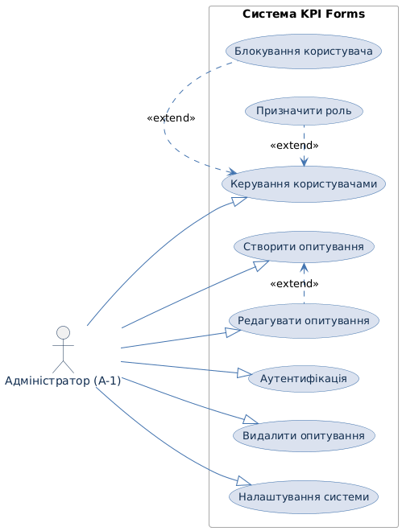
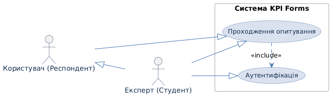
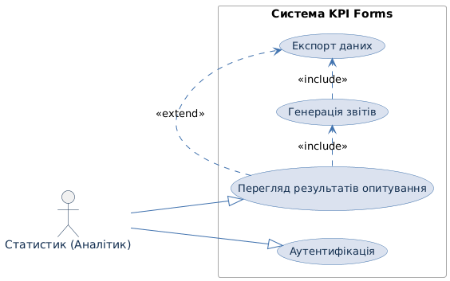
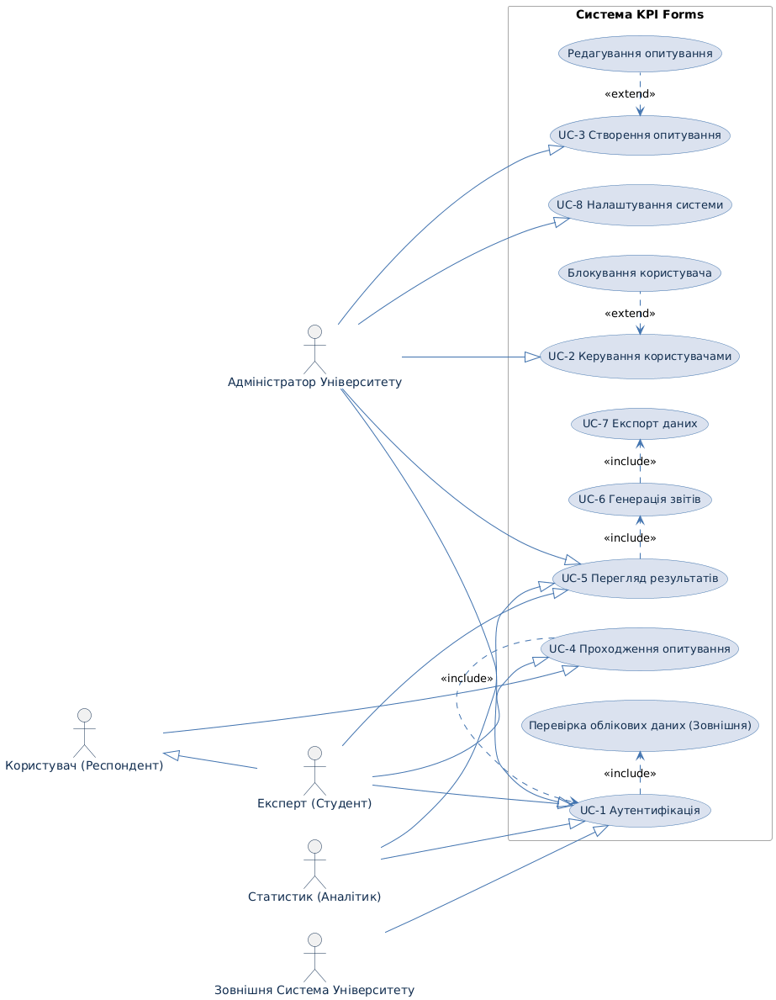

# Аналіз вимог та Специфікації системи «KPI Forms» 📝

## 1. Ключові користувачі (Actors)

Визначено ролі користувачів, які будуть взаємодіяти з системою, що відповідає моделі прецедентів.

| Роль | Опис | 
 | ----- | ----- | 
| **Адміністратор** | Керує системою, додає/видаляє користувачів, змінює налаштування, створює та керує опитуваннями. | 
| **Експерт** | Проходить аутентифікацію та відповідає на опитування (у контексті університету це **Студент**). | 
| **Користувач (Респондент)** | Проходить опитування. | 
| **Статистик** | Переглядає, аналізує зібрані результати та генерує звіти (у контексті університету це **Адміністратор Університету** або **Аналітик**). | 

## 2. Основні прецеденти (Use Cases)

Перелік ключових функціональних можливостей системи, що відображає основні дії користувачів.

| Прецедент | Учасники | 
 | ----- | ----- | 
| **Аутентифікація** | Адміністратор, Експерт, Статистик | 
| **Проходження опитування** | Користувач, Експерт | 
| **Перегляд результатів опитування** | Статистик, Адміністратор | 
| **Керування користувачами** | Адміністратор | 
| **Створення опитування** | Адміністратор | 
| **Редагування опитування** | Адміністратор | 
| **Видалення опитування** | Адміністратор | 
| **Експорт даних** | Статистик | 
| **Генерація звітів** | Статистик | 
| **Налаштування системи** | Адміністратор | 

## 3. Взаємозв’язки Use Case

Опис зв'язків між прецедентами (`Include`, `Extend`) та між акторами (`Generalization`).

### 3.1. Зв'язки Inclusion (Включення)

| Основний прецедент | Включає | 
 | ----- | ----- | 
| **Проходження опитування** | "Аутентифікацію" (для експертів) | 
| **Перегляд результатів опитування** | "Генерацію звітів" | 
| **Генерація звітів** | "Експорт даних" | 
| **Експорт даних** | "Перегляд результатів опитування" (якщо експорт ініціюється з форми перегляду) | 

### 3.2. Зв'язки Extension (Розширення)

| Основний прецедент | Розширення | 
 | ----- | ----- | 
| **Керування користувачами** | "Блокування користувача" | 
| **Створення опитування** | "Редагування опитування" (редагування є більш детальною формою створення/оновлення) | 

### 3.3. Зв'язки Generalization (Узагальнення)

| Базовий актор / Прецедент | Підтипи | 
 | ----- | ----- | 
| **Респондент** | "Користувач", "Експерт" | 
| **Перегляд результатів опитування** | "Статистик", "Адміністратор" | 

## 4. Побудова UML-діаграми

### 4.1. Зображення UML-діаграм

Діаграма 1: Адміністратор. Відображає всі прецеденти керування системою, користувачами та опитуваннями.

Діаграма 2: Експерт та Користувач (Респондент). Відображає прецеденти проходження аутентифікації та участі в опитуванні.

Діаграма 3: Статистик. Відображає прецеденти аналізу, генерації звітів та експорту даних.

Діаграма 4: Загальна схема. Відображає всіх акторів, усі прецеденти та їхні зв'язки у межах системи «KPI Forms».

## 5. Специфікації прецедентів (CRUD та Керування)

Деталізований опис сценаріїв використання для ключових функцій.

### 5.1. Керування користувачами (User Management)

#### CreateUser

| ID | CreateUser | 
 | ----- | ----- | 
| **НАЗВА** | Створити користувача | 
| **УЧАСНИКИ** | Адміністратор, Система | 
| **ПЕРЕДУМОВИ** | – Адміністратор авторизований; – Адміністратор має відповідні права доступу. | 
| **РЕЗУЛЬТАТ** | Новий користувач створений у системі. | 
| **ВИКЛЮЧНІ СИТУАЦІЇ** | – **CreateUser_UserAlreadyExists_EXC:** Користувач з таким email уже існує. – **CreateUser_InvalidInput_EXC:** Введено некоректні дані. – **CreateUser_CancelButton_EXC:** Адміністратор натиснув "Відміна". | 
| **ОСНОВНИЙ СЦЕНАРІЙ** | 1\. Адміністратор переходить до розділу "Користувачі" → "Створити користувача". 2. Заповнює форму з необхідними даними (ім’я, email, роль, тощо). 3. Натискає кнопку "Зберегти" (можлива CreateUser_CancelButton_EXC). 4. Система перевіряє унікальність email та валідність даних. 5. Система створює нового користувача та відображає повідомлення про успішне створення. | 

#### ReadUser

| ID | ReadUser | 
 | ----- | ----- | 
| **НАЗВА** | Переглянути користувача | 
| **УЧАСНИКИ** | Адміністратор, Система | 
| **ПЕРЕДУМОВИ** | – Адміністратор авторизований; – Користувач існує в системі. | 
| **РЕЗУЛЬТАТ** | Відображено детальну інформацію про користувача. | 
| **ВИКЛЮЧНІ СИТУАЦІЇ** | – **ReadUser_UserNotFound_EXC:** Користувач не знайдений. – **ReadUser_CancelButton_EXC:** Адміністратор натиснув "Відміна". | 
| **ОСНОВНИЙ СЦЕНАРІЙ** | 1\. Адміністратор переходить до розділу "Користувачі". 2. Вибирає потрібного користувача зі списку. 3. Система перевіряє, чи існує користувач. 4. Система відображає детальну інформацію. 5. Адміністратор переглядає інформацію. | 

#### UpdateUser

| ID | UpdateUser | 
 | ----- | ----- | 
| **НАЗВА** | Оновити інформацію користувача | 
| **УЧАСНИКИ** | Адміністратор, Система | 
| **ПЕРЕДУМОВИ** | – Адміністратор авторизований; – Користувач існує в системі. | 
| **РЕЗУЛЬТАТ** | Інформацію про користувача оновлено в системі. | 
| **ВИКЛЮЧНІ СИТУАЦІЇ** | – **UpdateUser_UserNotFound_EXC:** Користувача не знайдено. – **UpdateUser_InvalidInput_EXC:** Недійсні або некоректні дані. – **UpdateUser_CancelButton_EXC:** Адміністратор натиснув "Відміна". | 
| **ОСНОВНИЙ СЦЕНАРІЙ** | 1\. Адміністратор вибирає користувача для редагування. 2. Система перевіряє, чи існує користувач. 3. Адміністратор редагує дані. 4. Натискає кнопку "Зберегти". 5. Система перевіряє введені дані. 6. У разі успіху — система оновлює дані користувача та повідомляє про успіх. | 

#### DeleteUser

| ID | DeleteUser | 
 | ----- | ----- | 
| **НАЗВА** | Видалити користувача | 
| **УЧАСНИКИ** | Адміністратор, Система | 
| **ПЕРЕДУМОВИ** | – Адміністратор авторизований; – Користувач існує в системі. | 
| **РЕЗУЛЬТАТ** | Користувача видалено із системи або змінено його статус на "неактивний". | 
| **ВИКЛЮЧНІ СИТУАЦІЇ** | – **DeleteUser_UserNotFound_EXC:** Користувач не знайдений. – **DeleteUser_ProtectedUser_EXC:** Спроба видалити критичного системного користувача. – **DeleteUser_CancelButton_EXC:** Адміністратор натиснув "Відміна". | 
| **ОСНОВНИЙ СЦЕНАРІЙ** | 1\. Адміністратор вибирає користувача для видалення. 2. Система перевіряє наявність та критичність користувача. 3. Адміністратор натискає "Видалити" → підтверджує дію. 4. Система видаляє або архівує користувача. | 

#### AssignRole

| ID | AssignRole | 
 | ----- | ----- | 
| **НАЗВА** | Призначити роль користувачу | 
| **УЧАСНИКИ** | Адміністратор, Система | 
| **ПЕРЕДУМОВИ** | – Адміністратор авторизований; – Користувач існує в системі. | 
| **РЕЗУЛЬТАТ** | Користувачу призначено нову роль у системі. | 
| **ВИКЛЮЧНІ СИТУАЦІЇ** | – **AssignRole_UserNotFound_EXC:** Користувача не знайдено. – **AssignRole_InvalidRole_EXC:** Обрана недійсна/заборонена роль. – **AssignRole_CancelButton_EXC:** Адміністратор натиснув "Відміна". | 
| **ОСНОВНИЙ СЦЕНАРІЙ** | 1\. Адміністратор переходить до профілю користувача. 2. Вибирає дію "Призначити роль". 3. Адміністратор обирає роль зі списку. 4. Система перевіряє валідність ролі та оновлює дані користувача. | 

### 5.2. Керування опитуваннями (Survey Management)

#### CreateSurvey

| ID | CreateSurvey | 
 | ----- | ----- | 
| **НАЗВА** | Створити опитування | 
| **УЧАСНИКИ** | Адміністратор, Система | 
| **ПЕРЕДУМОВИ** | – Адміністратор авторизований. | 
| **РЕЗУЛЬТАТ** | Нове опитування створене та збережене в системі. | 
| **ВИКЛЮЧНІ СИТУАЦІЇ** | – **CreateSurvey_InvalidInput_EXC:** Некоректно заповнені поля. – **CreateSurvey_DuplicateTitle_EXC:** Назва опитування вже існує. – **CreateSurvey_CancelButton_EXC:** Адміністратор натиснув "Відміна". | 
| **ОСНОВНИЙ СЦЕНАРІЙ** | 1\. Адміністратор переходить до розділу "Опитування" → "Створити нове". 2. Заповнює основну інформацію. 3. Додає запитання. 4. Натискає "Зберегти як чернетку". 5. Система перевіряє валідність даних та зберігає опитування. | 

#### ReadSurvey

| ID | ReadSurvey | 
 | ----- | ----- | 
| **НАЗВА** | Переглянути опитування | 
| **УЧАСНИКИ** | Адміністратор, Експерт, Система | 
| **ПЕРЕДУМОВИ** | – Користувач авторизований; – Має право доступу до опитування. | 
| **РЕЗУЛЬТАТ** | Відображено вміст опитування з усіма деталями. | 
| **ВИКЛЮЧНІ СИТУАЦІЇ** | – **ReadSurvey_SurveyNotFound_EXC:** Опитування не знайдено. – **ReadSurvey_NoAccessRights_EXC:** Користувач не має прав перегляду. – **ReadSurvey_CancelButton_EXC:** Користувач натиснув "Відміна". | 
| **ОСНОВНИЙ СЦЕНАРІЙ** | 1\. Користувач переходить у розділ "Опитування". 2. Вибирає потрібне опитування зі списку. 3. Система перевіряє наявність та права доступу. 4. Якщо перевірки успішні — відображає всю інформацію про опитування. | 

#### UpdateSurvey

| ID | UpdateSurvey | 
 | ----- | ----- | 
| **НАЗВА** | Оновити опитування | 
| **УЧАСНИКИ** | Адміністратор, Система | 
| **ПЕРЕДУМОВИ** | – Адміністратор авторизований; – Опитування існує; – Опитування ще не опубліковане. | 
| **РЕЗУЛЬТАТ** | Збережено зміни до опитування. | 
| **ВИКЛЮЧНІ СИТУАЦІЇ** | – **UpdateSurvey_SurveyNotFound_EXC:** Опитування не знайдено. – **UpdateSurvey_AlreadyPublished_EXC:** Опитування вже опубліковано. – **UpdateSurvey_InvalidInput_EXC:** Некоректні дані. – **UpdateSurvey_CancelButton_EXC:** Адміністратор натиснув "Відміна". | 
| **ОСНОВНИЙ СЦЕНАРІЙ** | 1\. Адміністратор відкриває опитування для редагування. 2. Система перевіряє наявність та статус опитування. 3. Адміністратор змінює дані. 4. Натискає "Зберегти". 5. У разі успіху — опитування оновлюється. | 

#### DeleteSurvey

| ID | DeleteSurvey | 
 | ----- | ----- | 
| **НАЗВА** | Видалити опитування | 
| **УЧАСНИКИ** | Адміністратор, Система | 
| **ПЕРЕДУМОВИ** | – Адміністратор авторизований; – Опитування існує. | 
| **РЕЗУЛЬТАТ** | Опитування видалено або позначено як "архівоване". | 
| **ВИКЛЮЧНІ СИТУАЦІЇ** | – **DeleteSurvey_SurveyNotFound_EXC:** Опитування не знайдено. – **DeleteSurvey_AlreadyPublished_EXC:** Опубліковане опитування не можна видалити. – **DeleteSurvey_CancelButton_EXC:** Адміністратор натиснув "Відміна". | 
| **ОСНОВНИЙ СЦЕНАРІЙ** | 1\. Адміністратор обирає опитування для видалення. 2. Система перевіряє, чи можна його видалити. 3. Адміністратор підтверджує дію. 4. Система видаляє або архівує опитування. | 

#### PublishSurvey

| ID | PublishSurvey | 
 | ----- | ----- | 
| **НАЗВА** | Опублікувати опитування | 
| **УЧАСНИКИ** | Адміністратор, Система | 
| **ПЕРЕДУМОВИ** | – Адміністратор авторизований; – Опитування збережене та не опубліковане; – Є хоча б одне запитання. | 
| **РЕЗУЛЬТАТ** | Опитування доступне для проходження. | 
| **ВИКЛЮЧНІ СИТУАЦІЇ** | – **PublishSurvey_SurveyNotFound_EXC:** Опитування не знайдено. – **PublishSurvey_AlreadyPublished_EXC:** Опитування вже опубліковане. – **PublishSurvey_EmptySurvey_EXC:** В опитуванні немає запитань. | 
| **ОСНОВНИЙ СЦЕНАРІЙ** | 1\. Адміністратор відкриває опитування. 2. Система перевіряє його наявність та валідність. 3. Адміністратор натискає "Опублікувати". 4. Система оновлює статус на "Опубліковано" та робить його доступним для експертів. | 

### 5.3. Керування питаннями (Question Management - CRUD)

#### CreateQuestion

| ID | CreateQuestion | 
 | ----- | ----- | 
| **НАЗВА** | Створити запитання | 
| **УЧАСНИКИ** | Адміністратор | 
| **ПЕРЕДУМОВИ** | – Адміністратор авторизований; – Опитування існує і знаходиться в статусі "Чернетка". | 
| **РЕЗУЛЬТАТ** | Нове запитання додано до опитування. | 
| **ВИКЛЮЧНІ СИТУАЦІЇ** | – **CreateQuestion_InvalidInput_EXC:** Некоректні дані. | 
| **ОСНОВНИЙ СЦЕНАРІЙ** | 1\. Адміністратор додає нове запитання до форми, вказуючи тип та текст. 2. Система перевіряє дані. 3. Запитання додається до опитування. | 

#### UpdateQuestion

| ID | UpdateQuestion | 
 | ----- | ----- | 
| **НАЗВА** | Оновити запитання | 
| **УЧАСНИКИ** | Адміністратор | 
| **ПЕРЕДУМОВИ** | – Адміністратор авторизований; – Запитання існує в опитуванні "Чернетка". | 
| **РЕЗУЛЬТАТ** | Запитання оновлено в опитуванні. | 
| **ВИКЛЮЧНІ СИТУАЦІЇ** | – **UpdateQuestion_QuestionNotFound_EXC:** Запитання не знайдено. – **UpdateQuestion_InvalidInput_EXC:** Некоректні дані. | 
| **ОСНОВНИЙ СЦЕНАРІЙ** | 1\. Адміністратор вибирає запитання для редагування. 2. Система перевіряє наявність запитання. 3. Адміністратор змінює запитання (текст, тип, обов'язковість). 4. Запитання оновлюється. | 

#### DeleteQuestion

| ID | DeleteQuestion | 
 | ----- | ----- | 
| **НАЗВА** | Видалити запитання | 
| **УЧАСНИКИ** | Адміністратор | 
| **ПЕРЕДУМОВИ** | – Адміністратор авторизований; – Запитання існує в опитуванні "Чернетка". | 
| **РЕЗУЛЬТАТ** | Запитання видалено з опитування. | 
| **ВИКЛЮЧНІ СИТУАЦІЇ** | – **DeleteQuestion_QuestionNotFound_EXC:** Запитання не знайдено. | 
| **ОСНОВНИЙ СЦЕНАРІЙ** | 1\. Адміністратор вибирає запитання для видалення. 2. Система перевіряє наявність запитання. 3. Запитання видаляється з опитування. | 

#### ReorderQuestions

| ID | ReorderQuestions | 
 | ----- | ----- | 
| **НАЗВА** | Перемістити запитання | 
| **УЧАСНИКИ** | Адміністратор | 
| **ПЕРЕДУМОВИ** | – Адміністратор авторизований; – Запитання існують. | 
| **РЕЗУЛЬТАТ** | Запитання переміщено в опитуванні. | 
| **ВИКЛЮЧНІ СИТУАЦІЇ** | – **ReorderQuestions_InvalidOrder_EXC:** Некоректне розташування. | 
| **ОСНОВНИЙ СЦЕНАРІЙ** | 1\. Адміністратор переміщає запитання в новому порядку за допомогою drag-and-drop або іншого інтерфейсу. 2. Система перевіряє коректність порядку. 3. Запитання зберігаються у новому порядку. | 

### 5.4. Робота з відповідями (Submission/Review)

#### SubmitAnswer

| ID | SubmitAnswer | 
 | ----- | ----- | 
| **НАЗВА** | Подати відповідь | 
| **УЧАСНИКИ** | Користувач (Експерт/Респондент) | 
| **ПЕРЕДУМОВИ** | – Користувач авторизований; – Форма заповнена. | 
| **РЕЗУЛЬТАТ** | Відповідь збережена в системі з дотриманням анонімності. | 
| **ВИКЛЮЧНІ СИТУАЦІЇ** | – **SubmitAnswer_InvalidInput_EXC:** Некоректна відповідь (наприклад, пропущене обов'язкове поле). | 
| **ОСНОВНИЙ СЦЕНАРІЙ** | 1\. Користувач заповнює форму. 2. Користувач натискає "Подати відповідь". 3. Система перевіряє відповідь на валідність та обов'язковість полів. 4. Відповідь зберігається у таблиці `Response` та `Answer`. | 

#### ViewAnswers

| ID | ViewAnswers | 
 | ----- | ----- | 
| **НАЗВА** | Переглянути відповіді | 
| **УЧАСНИКИ** | Експерт, Адміністратор, Статистик | 
| **ПЕРЕДУМОВИ** | – Користувач авторизований; – Відповіді існують; – Користувач має права доступу до результатів. | 
| **РЕЗУЛЬТАТ** | Відповіді відображаються у візуалізованій та/або табличній формі. | 
| **ВИКЛЮЧНІ СИТУАЦІЇ** | – **ViewAnswers_AnswerNotFound_EXC:** Відповіді не знайдено. – **ViewAnswers_NoAccess_EXC:** Недостатньо прав для перегляду. | 
| **ОСНОВНИЙ СЦЕНАРІЙ** | 1\. Адміністратор/Статистик відкриває розділ "Аналіз". 2. Вибирає опитування. 3. Система відображає зведені (або детальні) відповіді з можливістю фільтрації. |