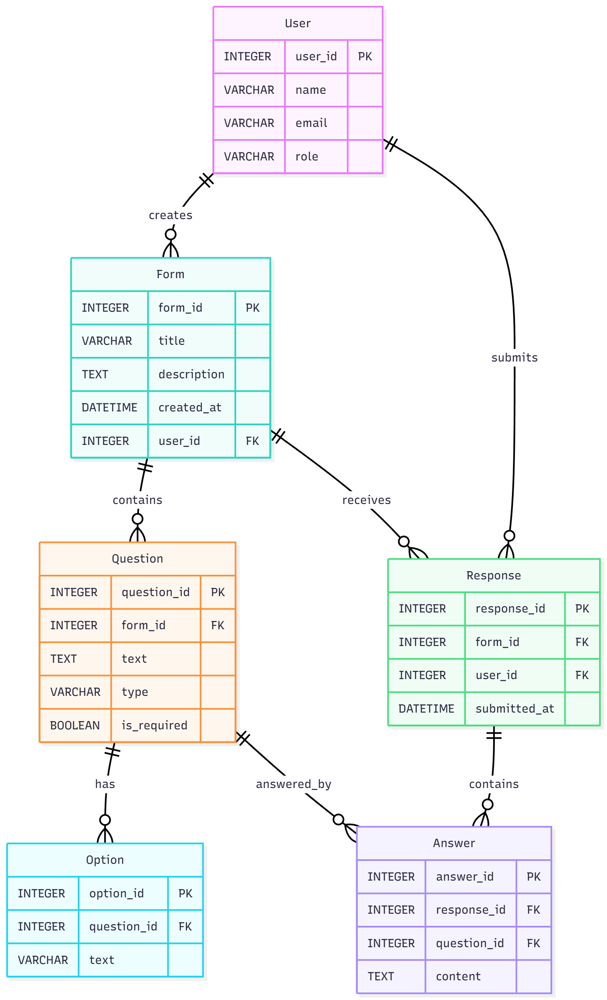

# Реляційна схема бази даних «KPI Forms» 💾

Цей документ містить логічну реляційну схему та DDL-скрипти (SQL-таблиці) для створення бази даних Системи «KPI Forms».

## 1. Концептуальна реляційна схема

Схема розроблена для підтримки ключових функціональних вимог, включаючи створення форм, керування питаннями різних типів та забезпечення анонімного збору відповідей.

### Таблиця 1: User (Користувачі)

Зберігає інформацію про всіх користувачів системи (адміністраторів, студентів).

| Поле | Тип даних | Ключ | Примітки |
| :--- | :--- | :--- | :--- |
| **user_id** | INTEGER | PRIMARY KEY | Унікальний ідентифікатор користувача. |
| name | VARCHAR(100) | | ПІБ або ім'я користувача. |
| email | VARCHAR(100) | UNIQUE | Корпоративний e-mail (для авторизації). |
| role | VARCHAR(50) | | Роль у системі (Student, Admin, SysAdmin). |

### Таблиця 2: Form (Форми/Опитування)

Зберігає інформацію про кожне створене опитування.

| Поле | Тип даних | Ключ | Примітки |
| :--- | :--- | :--- | :--- |
| **form_id** | INTEGER | PRIMARY KEY | Унікальний ідентифікатор форми. |
| title | VARCHAR(255) | NOT NULL | Назва опитування. |
| description | TEXT | | Детальний опис опитування. |
| created_at | DATETIME | DEFAULT CURRENT_TIMESTAMP | Дата створення форми. |
| user_id | INTEGER | FOREIGN KEY | Посилання на автора форми (User). |

### Таблиця 3: Question (Питання)

Зберігає деталі кожного питання в межах форми.

| Поле | Тип даних | Ключ | Примітки |
| :--- | :--- | :--- | :--- |
| **question_id** | INTEGER | PRIMARY KEY | Унікальний ідентифікатор питання. |
| **form_id** | INTEGER | FOREIGN KEY | Посилання на форму (Form). |
| text | TEXT | NOT NULL | Текст питання. |
| type | VARCHAR(50) | NOT NULL | Тип питання (Text, Choice, Scale, Multiple). |
| is_required | BOOLEAN | DEFAULT FALSE | Чи є питання обов'язковим для відповіді. |

### Таблиця 4: Option (Варіанти вибору)

Зберігає варіанти відповіді для питань типу "вибір" або "множинний вибір".

| Поле | Тип даних | Ключ | Примітки |
| :--- | :--- | :--- | :--- |
| **option_id** | INTEGER | PRIMARY KEY | Унікальний ідентифікатор варіанта. |
| **question_id** | INTEGER | FOREIGN KEY | Посилання на питання (Question). |
| text | VARCHAR(255) | NOT NULL | Текст варіанта відповіді. |

### Таблиця 5: Response (Відповіді респондентів)

Запис про факт проходження опитування. Використовується для агрегації відповідей.

| Поле | Тип даних | Ключ | Примітки |
| :--- | :--- | :--- | :--- |
| **response_id** | INTEGER | PRIMARY KEY | Унікальний ідентифікатор факту відповіді. |
| **form_id** | INTEGER | FOREIGN KEY | Посилання на форму (Form). |
| user_id | INTEGER | FOREIGN KEY | **NULLABLE:** Забезпечення анонімності. Для анонімних опитувань поле може бути NULL. |
| submitted_at | DATETIME | DEFAULT CURRENT_TIMESTAMP | Час подачі відповіді. |

### Таблиця 6: Answer (Відповіді на питання)

Зберігає фактичний зміст відповіді на конкретне питання.

| Поле | Тип даних | Ключ | Примітки |
| :--- | :--- | :--- | :--- |
| **answer_id** | INTEGER | PRIMARY KEY | Унікальний ідентифікатор відповіді. |
| **response_id** | INTEGER | FOREIGN KEY | Посилання на загальну відповідь (Response). |
| **question_id** | INTEGER | FOREIGN KEY | Посилання на питання (Question). |
| content | TEXT | | Зміст відповіді (текст, значення шкали, ID вибраного Option). |

## 2. SQL-таблиці (DDL - Data Definition Language)

Нижче наведено SQL-скрипти для створення таблиць, які відповідають концептуальній моделі.

```sql
CREATE TABLE User (
  user_id INTEGER PRIMARY KEY,
  name VARCHAR(100),
  email VARCHAR(100) UNIQUE,
  role VARCHAR(50) -- Student, AdminU, SysAdmin
);

CREATE TABLE Form (
  form_id INTEGER PRIMARY KEY,
  title VARCHAR(255) NOT NULL,
  description TEXT,
  created_at DATETIME DEFAULT CURRENT_TIMESTAMP,
  user_id INTEGER,
  FOREIGN KEY (user_id) REFERENCES User(user_id)
);

CREATE TABLE Question (
  question_id INTEGER PRIMARY KEY,
  form_id INTEGER,
  text TEXT NOT NULL,
  type VARCHAR(50) NOT NULL, -- Text, Choice, Scale, Multiple
  is_required BOOLEAN DEFAULT FALSE,
  FOREIGN KEY (form_id) REFERENCES Form(form_id)
);

CREATE TABLE Option (
  option_id INTEGER PRIMARY KEY,
  question_id INTEGER,
  text VARCHAR(255) NOT NULL,
  FOREIGN KEY (question_id) REFERENCES Question(question_id)
);

CREATE TABLE Response (
  response_id INTEGER PRIMARY KEY,
  form_id INTEGER,
  user_id INTEGER, -- NULLABLE: Для анонімних опитувань
  submitted_at DATETIME DEFAULT CURRENT_TIMESTAMP,
  FOREIGN KEY (form_id) REFERENCES Form(form_id),
  FOREIGN KEY (user_id) REFERENCES User(user_id)
);

CREATE TABLE Answer (
  answer_id INTEGER PRIMARY KEY,
  response_id INTEGER,
  question_id INTEGER,
  content TEXT, -- Зміст відповіді (текст, або ID опції, або JSON для множинного вибору)
  FOREIGN KEY (response_id) REFERENCES Response(response_id),
  FOREIGN KEY (question_id) REFERENCES Question(question_id)
);
```

## Візуаьна Схема
